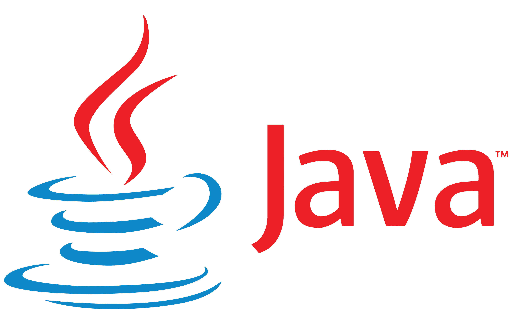

# **Hey! Mi nombre es Daniel👋**

 # **Me presento**:

Mi nombre es Daniel Rodríguez soy **Técnico en Sistemas Microinformáticos y Redes 💻**, actualmente estoy estudiando el primer año en **Técnico Superior en Desarrollo de Aplicaciones Multiplataforma** 👨‍🎓 en el [IES LUIS VIVES](https://github.com/IESLuisVives) de Leganés (Madrid).

Me gusta el mundo de la progrmación, el desarrollo de código de la aplicación, diseño de la interfaz... Antes de comenzar en el mundo laboral de la programación me gustaría realizar la Ingeniería Informática en la [Universidad de Granada](https://www.ugr.es). Y en el futuro me gustaría crear una aplicación destinada a la gestión de empresas, gestionable desde un móvil, tablet u ordeanador. Después de años dedicandome al desarrollo, me gustaría ejercer como profesor en Ciclos de Grado Medio y Grado Superior, enseñando y transmitiendo mis conocimientos.

En mi tiempo libre me gusta escuchar musica ♬, estar con mi familia y amigos 👨‍👧‍👦, perderme por el mundo viajando ✈, ver series/peliculas 🎬 y en cuanto puedo en la playa descansando y disfrutando 🚣.

Aquí esta mi repositorio de GitHub donde tengo todos los proyectos que he ido realizando durante mi paso por mi formación. Los puedes usar, pero si los usas etiqueteme o mencioname me haría ilusión.

## **Mi etapa actual como estudiante de DAM:**

Actualmente estoy en el [IES LUIS VIVES](https://github.com/IESLuisVives) finalizando el primer año de 1º de DAM, en dos meses comenzaré 2º de DAM, hasta el mes de marzo que comenzaré las prácticas en empresa. En programación hemos visto desde como nombrar una variable a como realizar un CRUD completo sobre una aplicación de gestión, en mi caso de [GADAM](https://github.com/idanirf/GADAM) un programa de gestión de almacenes y pedidos.

**Y como dice un profesor mío:**

> ***A programar se aprende programando*** - **[Jose Luis González](https://github.com/joseluisgs)**

 

---
## **Mis Redes Sociales y Contacto:**

---

 
 

 
 
 Correo Personal (daniel.rodrifdez@gmail.com)
 
 
 Correo Educativo (daniel.rodriguezfernandez@alumno.iesluisvives.org)
 
 
 idanirf#5495
 
 

---
## **Lenguajes que he utilizado:**
---
   

   TypeScript
   
   
   
   
   
  
   
   
  
   
   
  
   
   
    
   
   

---
## **Entornos de Desarrollo y Tecnologías que he utilizado:**

---
 

 
 
 

 

 

 

 
 
---

## **Mis Estadísticas:**
---
 

